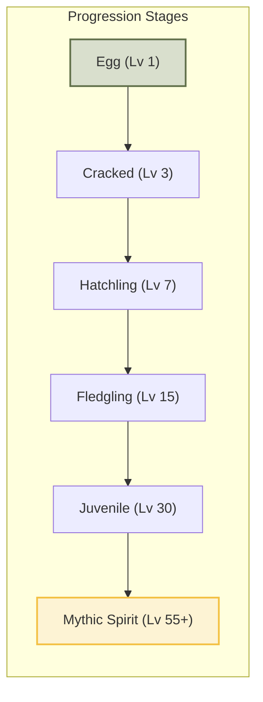

<div align="center">

  

# Aethra

**Nurture Your Mind. Cultivate Your Spirit.**

  <p>
    <a href="https://github.com/gtxPrime/Aethra/stargazers">
      
    </a>
    <a href="https://github.com/gtxPrime/Aethra/network/members">
      
    </a>
    <a href="https://github.com/gtxPrime/Aethra/issues">
      
    </a>
    <a href="https://github.com/gtxPrime/Aethra/blob/main/LICENSE">
      
    </a>
    <a href="#">
      
    </a>
  </p>

  <h3>
    <a href="#-about-aethra">About</a>
    <span> | </span>
    <a href="#-features">Features</a>
    <span> | </span>
    <a href="#-spirit-garden--pet-evolution">Spirit Garden</a>
    <span> | </span>
    <a href="#-security--privacy-vault">Security & Privacy</a>
    <span> | </span>
    <a href="#-tech-stack">Tech Stack</a>
    <span> | </span>
    <a href="#-installation--setup">Setup</a>
  </h3>

</div>

---

## 🌿 About Aethra

**Aethra** is a private, gamified journaling and mood-tracking ecosystem designed to transform emotional self-reflection into a rewarding journey. By mapping your emotional landscapes to virtual spirit companions, Aethra encourages daily mindfulness, tracks key health variables, and protects your thoughts with state-of-the-art cryptographic security.

Every journal entry you write contributes energy to a companion corresponding to your dominant emotion. As you reflect, your companions hatch, grow, and evolve—turning your psychological resilience into a tangible, beautiful virtual garden.

> *"What is written is remembered, and what is nurtured grows."*

---

## 🚀 Features

### 📝 Immersive Journaling & Reflections
Capture your inner thoughts with a rich, multi-media journaling interface:
- **Rich Media Integration:** Record voice notes, capture images/videos via built-in CameraX integrations, and attach them directly to your entries.
- **Holistic Reflection Parameters:** Track variables including sleep quality index, caffeine consumption, social circles (people tags), location, and real-time weather metadata.
- **Inline Text Styling:** Support for custom styling ranges saved directly as structured JSON.
- **Analytics-Aware Writing:** Track writing session durations automatically to observe your reflection patterns.

### 📊 Deep Insights & Health Correlations
Visualize the trends behind your emotional well-being:
- **Mood Breakdown:** Track mood distribution ratios across your entries.
- **Caffeine vs. Sleep Correlation:** Interactive analytics mapping how your caffeine habits affect sleep quality.
- **Streak & Consistency Trackers:** Visualize writing habits and daily reflection chains.

### 🔔 Daily Mindful Reminders
- Schedule customized reminders via Android's `AlarmManager` to establish healthy, long-term writing routines.

---

## 🥚 Spirit Garden & Pet Evolution

Aethra visualizes your emotional states as unique spirit companions. Cultivating entries of a specific emotion channels energy into that mood's companion, triggering level-ups and evolutions.

### The 6 Mood Archetypes & Companions

| Mood | Color | Companion | Description |
| :--- | :--- | :--- | :--- |
| **Bright** | `Golden Yellow` | **Auros** / **Solfen** | Born from joy and warmth; lights up hidden corners of your mind. |
| **Calm** | `Sage Green` | **Verdis** | A serene presence that smooths out anxious thoughts. |
| **Heavy** | `Forest Green` | **Lumbre** | Born of unspoken burdens; slowly transforms grief into resilience. |
| **Tangled** | `Terracotta` | **Nixara** | A knot of confusion teaching patience as feelings unravel. |
| **Dark** | `Near-Black` | **Umbrix** | A shadow companion providing comfort in the quiet of night. |
| **Blank** | `Steel Blue` | **Vael** | An empty slate representing the potential for new beginnings. |

### Growth & Evolution Stages
Companions progress through **six major evolutionary stages** based on the count of qualifying daily reflections:


- **Dynamic Catalog Sync:** The app's companion catalog is synced in the background using `WorkManager` (runs every 24 hours), loading configuration schemas from a Firebase Remote Config JSON payload without interrupting active sessions.

---

## 🔒 Security & Privacy Vault

Your journal is your most private space. Aethra implements robust defensive features to protect your data from physical and digital intrusion:

*   **Biometric Authentication:** Gate the app behind strong device credentials (Fingerprint, Face Unlock, or PIN) via Android's `BiometricPrompt`.
*   **Decoy PIN Mode:** Configure a secondary decoy PIN. If entered, the app unlocks in **Decoy Mode**—hiding your actual database, displaying a clean, empty state, and protecting you from forced disclosure.
*   **Gallery & Capture Protection (`FLAG_SECURE`):** Toggling "Hide Media in Gallery" adds the window-level secure flag. This blocks screenshots, prevents screen recordings, and obscures previews in the Android system recent-apps panel.
*   **Chronicle Blurring:** Enable blurred previews to hide journal text snippets from the history list, requiring a tap to unlock and read.
*   **Encrypted Storage:** Underlying options for Android Keystore integration and SharedPreferences encryption.

---

## 🛠️ Tech Stack

Aethra is built on a modern, robust Android architecture:

-   **UI Layer:** [Jetpack Compose](https://developer.android.com/compose) for a declarative, fluid, and responsive user interface following material guidelines.
-   **Database:** [Room SQLite](https://developer.android.com/training/data-storage/room) for structured local storage of journal entries, database transactions, and pet progress.
-   **Preference Storage:** [Datastore Preferences](https://developer.android.com/topic/libraries/architecture/datastore) for secure, asynchronous setting states.
-   **Media Execution:** [Media3 ExoPlayer](https://developer.android.com/media/media3) for playing recorded voice notes.
-   **Background Processing:** [WorkManager](https://developer.android.com/topic/libraries/architecture/workmanager) for orchestrating resilient 24-hour sync tasks.
-   **Dependency & Build Management:** Gradle Version Catalog (`libs.versions.toml`) for modular dependency resolution.
-   **Backend Integrations:** [Firebase Remote Config](https://firebase.google.com/docs/remote-config) for cloud-controlled companion specifications.

---

## 🚀 Installation & Setup

### Prerequisites
- Android Studio Ladybug (or higher)
- JDK 17
- Android SDK 26+ (Minimum support)

### Setup Steps
1.  **Clone the Repository:**
    ```bash
    git clone https://github.com/gtxPrime/Aethra.git
    cd Aethra
    ```

2.  **Configure Firebase:**
    - Create a project on the [Firebase Console](https://console.firebase.google.com/).
    - Register an Android app with package name `com.gxdevs.aethra`.
    - Download `google-services.json`.
    - Place the downloaded file into the `app/` directory:
      ```bash
      # Check the example file for the configuration format
      cp app/google-services.json.example app/google-services.json
      ```

3.  **Build the Project:**
    - Open the directory in Android Studio.
    - Synchronize Gradle dependencies.
    - Run the application on a physical device or emulator.
      ```bash
      ./gradlew assembleDebug
      ```

---

## 📄 License

This project is licensed under the MIT License - see the [LICENSE](LICENSE) file for details.
