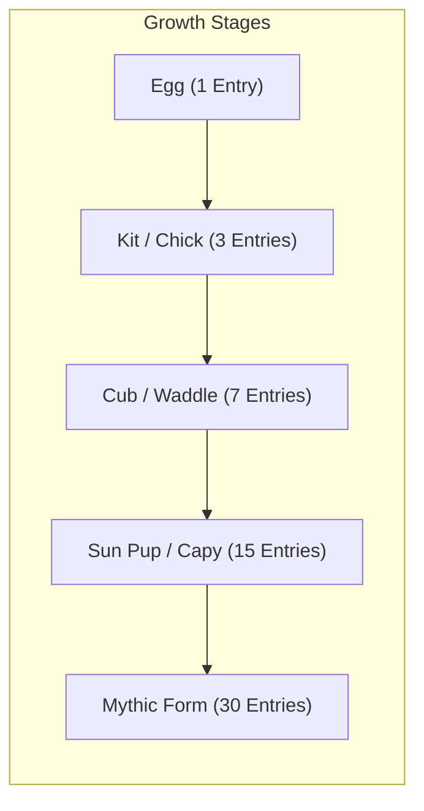

<div align="center">

  

# Lore

**Your Private Inner Sanctuary**

  <p>
    <a href="https://github.com/gtxPrime/Lore/stargazers">
      
    </a>
    <a href="https://github.com/gtxPrime/Lore/network/members">
      
    </a>
    <a href="https://github.com/gtxPrime/Lore/issues">
      
    </a>
    <a href="https://github.com/gtxPrime/Lore/blob/main/LICENSE">
      
    </a>
    <a href="#">
      
    </a>
  </p>

  <h3>
    <a href="#-about-lore">About</a>
    <span> | </span>
    <a href="#-features">Features</a>
    <span> | </span>
    <a href="#-sanctuary-companions--evolution">Companions</a>
    <span> | </span>
    <a href="#-security--privacy-vault">Security</a>
    <span> | </span>
    <a href="#-lore-scantury-pro">Lore Scantury</a>
    <span> | </span>
    <a href="#-tech-stack">Tech Stack</a>
    <span> | </span>
    <a href="#-installation--setup">Setup</a>
  </h3>

</div>

---

## 🌿 About Lore

**Lore** is an offline-first, privacy-focused gamified journaling and emotional sanctuary app designed to transform self-reflection into a soothing, meaningful journey. By mapping your feelings to living virtual companions, Lore encourages daily mindfulness, tracks mood landscapes, and shields your private reflections with cryptographic security.

Every journal entry you write channels growth energy into your sanctuary companions, allowing them to hatch from eggs into Mythic guardian forms.

> *"What is written is remembered, and what is nurtured grows."*

---

## 🚀 Features

### 📝 Immersive Sanctuary Journaling
- **Rich Media Attachments:** Capture voice notes, take photos/videos via CameraX, and attach media seamlessly.
- **On-Device Speech-to-Text & Mood Analytics:** Instant voice transcription and emotion keyword weighting.
- **Holistic Life Tracking:** Record sleep quality, caffeine intake, social circles, location, and real-time weather metadata.
- **Stealth Decoy Mode:** Access a stealth vault with a decoy PIN to protect your personal reflections.

### 🌟 Soothing Onboarding & Sanctuary Guide
- **4-Step Onboarding Flow:** Beautiful, paper-themed guide introducing sanctuary journaling, companion archetypes, growth mechanics, and privacy features.
- **Replay Anywhere:** Revisit the sanctuary guide anytime from Settings.

---

## 🐾 Sanctuary Companions & Evolution

Lore visualizes your emotional landscapes as virtual companions that absorb your daily reflections:

| Companion | Emotion Theme | Form | Description |
| :--- | :--- | :--- | :--- |
| **Solara** | **Bright** | `Sun Pup` | Born from golden warmth & morning sunrises. |
| **Cappi** | **Calm** | `Capybara` | Unhurried and serene; teaches that stillness is strength. |
| **Pebble** | **Heavy** | `Penguin` | Resilient & steady; knows how to carry heavy weight. |
| **River** | **Tangled** | `Otter` | Drifts through confusion, turning tangles into calm currents. |

### 5-Stage Evolutionary Progression


---

## 🛡️ Security & Privacy Vault

- **Biometric & PIN Lock:** Secure your app with Android Biometrics or custom PIN.
- **Decoy PIN Vault:** Enter a stealth PIN to load a completely separate, decoy journal vault.
- **Screenshot Protection:** Prevents screen grabs and hides recent app previews in task switchers.
- **End-to-End Encryption:** Local database encryption ensuring your private entries remain strictly yours.

---

## 💎 Lore Scantury Pro

Lore includes Google Play Billing Library v9 integration:
- **Google Sign-In Integration:** Mandatory Google Sign-In via AndroidX Credential Manager before purchase to link entitlements across devices.
- **Plans:** Monthly, Annual (50% OFF), and Lifetime passes.
- **Dev Test Mode:** Toggleable developer test mode for offline testing and QA.

---

## 🛠️ Tech Stack

- **Language:** Kotlin
- **UI Framework:** Jetpack Compose with Material 3 & Custom Sanctuary Design Tokens
- **Architecture:** MVVM with Clean Data Flow (Kotlin Flows / StateFlow)
- **Database:** Room DB with encrypted persistence
- **Preferences:** DataStore Preferences
- **Billing:** Google Play Billing Library v9
- **Authentication:** AndroidX Credential Manager (Google Sign-In)
- **Media & Hardware:** CameraX, Android MediaRecorder/MediaPlayer, Glide Compose

---

## 📦 Installation & Setup

1. **Clone the repository:**
   ```bash
   git clone https://github.com/gtxPrime/Lore.git
   cd Lore
   ```

2. **Open in Android Studio:**
   Import project into Android Studio Ladybug (or later) with JDK 17+.

3. **Build & Deploy:**
   ```bash
   ./gradlew installDebug
   ```

---

<div align="center">
  <sub>Crafted with care by <b>GxDevs</b></sub>
</div>
